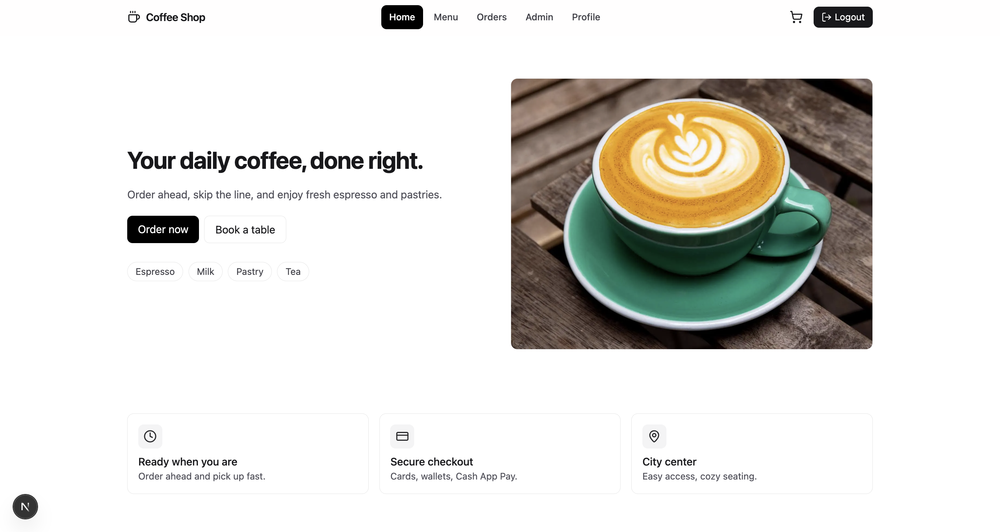
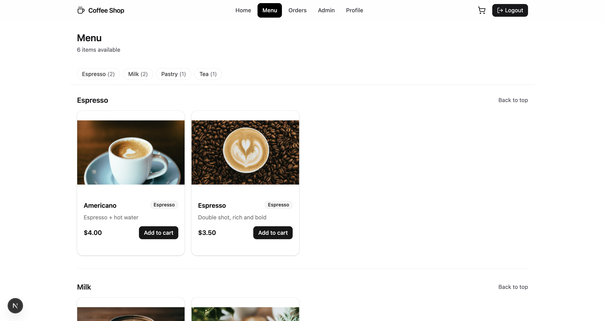
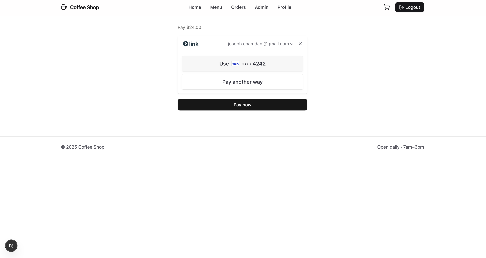
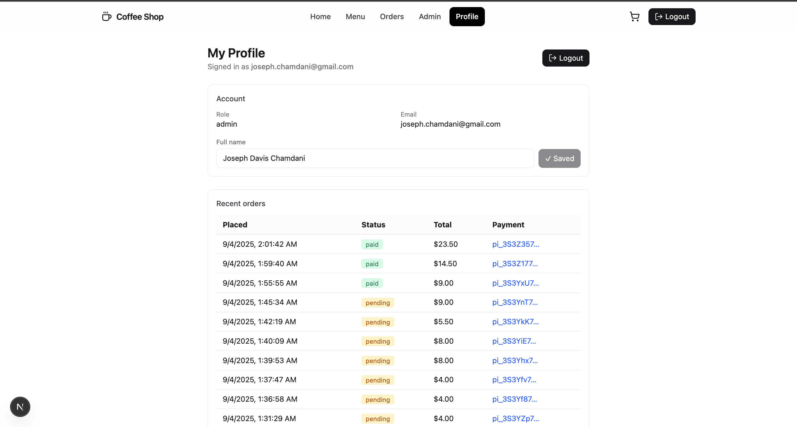
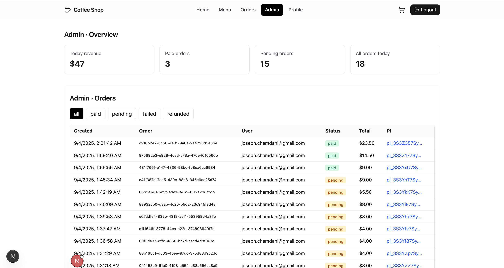

# ☕ Coffee Shop – Fullstack Demo

A modern coffee shop web app built with **Next.js 15 (App Router)**, **Supabase**, and **Stripe**.  
Order ahead, manage bookings, track orders, and explore a clean admin dashboard — all with magic link authentication.

---

## Features

- **Authentication** – Supabase magic links (email sign-in), with profile editing.
- **Cart & Checkout** – Add items, checkout securely via Stripe.
- **Orders** – View your recent orders, with live status updates.
- **Profile** – Update your name, view order history, manage your session.
- **Admin Dashboard** – View and filter all orders (paid, pending, failed, refunded).
- **Responsive UI** – Clean, mobile-friendly design with TailwindCSS + Lucide icons.

---

## Tech Stack

- [Next.js 15](https://nextjs.org/) (App Router + Turbopack)
- [Supabase](https://supabase.com/) (Auth, Database, API)
- [Stripe](https://stripe.com/) (Payments & webhooks)
- [Tailwind CSS](https://tailwindcss.com/) (UI styling)
- [Lucide React](https://lucide.dev/) (icons)
- [Sonner](https://sonner.emilkowal.ski/) (toast notifications)

---

## Project Structure

```
src/
 ├─ app/
 │   ├─ admin/         # Admin dashboard
 │   ├─ api/           # API routes (Stripe, profile, orders, etc.)
 │   ├─ checkout/      # Checkout flow
 │   ├─ login/         # Magic link sign-in
 │   ├─ orders/        # User orders
 │   ├─ profile/       # Profile page + form
 │   └─ (auth)/callback # Auth callback handler
 │
 ├─ components/        # UI components (navbar, cards, etc.)
 ├─ lib/               # Supabase, utils, formatting
 └─ public/            # Static assets (hero image, favicon, etc.)
```

---

## Getting Started

1. **Clone the repo**
   ```bash
   git clone https://github.com/JosephDavisC/coffee-shop.git
   cd coffee-shop
   ```

2. **Install dependencies**
   ```bash
   npm install
   ```

3. **Set up environment variables**  
   Create a `.env.local` file with:

   ```bash
   NEXT_PUBLIC_SUPABASE_URL=your_supabase_url
   NEXT_PUBLIC_SUPABASE_ANON_KEY=your_supabase_anon_key
   SUPABASE_SERVICE_ROLE_KEY=your_service_role_key

   STRIPE_SECRET_KEY=sk_test_123...
   STRIPE_WEBHOOK_SECRET=whsec_123...
   ```

4. **Run the dev server**
   ```bash
   npm run dev
   ```

   App will be available at: **http://localhost:3000**

---

## Testing Payments

- This project uses **Stripe test mode**.
- Use [Stripe test cards](https://stripe.com/docs/testing) like:
  - `4242 4242 4242 4242` (Visa – succeeds)
  - `4000 0000 0000 9995` (declined)

---

## Deployment

Deploy easily on [Vercel](https://vercel.com/) or [Netlify](https://www.netlify.com/).  
Make sure to set your Supabase + Stripe environment variables in the hosting dashboard.

---

## Screenshots

### 🏠 Home Page


### 📋 Menu Page


### 🛒 Checkout Page


### 📦 Orders Page


### 👤 Profile Page


### 🛠 Admin Dashboard


---

## 💡 Future Improvements

- Add table bookings
- Add product reviews
- Email receipts

---
